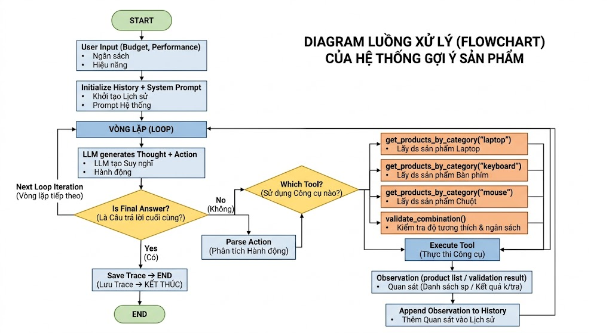

# Group Report: Lab 3 - Production-Grade Agentic System

- **Team Name**: [X2]
- **Team Members**: [Phương Hoàng Yến, Nguyễn Minh Châu, Trần Vọng Triển, Vũ Tiến Thành, Chu Minh Quân]
- **Deployment Date**: [2026-04-06]

---

## 1. Executive Summary

*Brief overview of the agent's goal and success rate compared to the baseline chatbot.*
- **Success Rate (Tỷ lệ thành công)**: **ReAct Agent: 7/8 test case (87.5%)** | **Baseline Chatbot: 1/8 test case (12.5%)**.
- **Key Outcome (Kết quả chính)**: ReAct Agent của chúng tôi đã giải quyết thành công 7 trên 8 truy vấn phức tạp. Chatbot cơ sở gần như thất bại hoàn toàn (chỉ vượt qua được 1 câu hỏi giao tiếp cơ bản) vì nó liên tục "ảo giác" (hallucinate) ra giá cả và tình trạng tồn kho do không thể truy cập vào cơ sở dữ liệu thực tế. 

---

2. System Architecture & Tooling
2.1 ReAct Loop Implementation
Diagram or description of the Thought-Action-Observation loop.

2.2 Tool Definitions (Inventory)
| Tool Name                | Input Format              | Use Case |
|--------------------------|--------------------------|----------|
| get_products_by_category | category (string)        | Liệt kê danh sách sản phẩm, giá net, hiệu năng và tồn kho theo danh mục (laptop, keyboard, mouse). |
| check_stock              | product_name (string)    | Kiểm tra nhanh trạng thái còn hàng/hết hàng và số lượng tồn kho cụ thể theo tên sản phẩm. |
| get_price                | product_name (string)    | Tra cứu chi tiết tài chính của sản phẩm bao gồm: giá gốc, phần trăm giảm giá và giá cuối cùng sau chiết khấu. |
| check_discount           | product_name (string)    | Chỉ lấy giá trị phần trăm (%) giảm giá của một sản phẩm cụ thể để phục vụ tính toán nhanh. |
| calculate_total          | item_ids (list of strings) | Tính tổng tiền cho một danh sách mã ID sản phẩm và đưa ra cảnh báo nếu có ID không tồn tại hoặc hết hàng. |
| validate_combination     | item_ids_str (string)    | Kiểm tra toàn diện một combo: tính tổng giá, tổng hiệu năng và xuất hóa đơn chi tiết kèm trạng thái hợp lệ của kho. |
2.3 LLM Providers Used
Primary: gemma-4-31b-it
---

## 3. Telemetry & Performance Dashboard

*Analyze the industry metrics collected during the final test run.*

- **Average Latency (P3)**: 49s
- **Max Latency (P3)**: 65.05s
- **Average Tokens per Task**: 2805
- **Total Cost of Test Suite**: $0.0015 (free vì sài API free, ước tính ở đây là khi bị limit phải sài bản trả phí)

---

## 4. Root Cause Analysis (RCA) - Failure Traces

*Deep dive into why the agent failed.*

## 4. Root Cause Analysis (RCA) - Phân tích Nguyên nhân Gốc rễ

*Phân tích sâu về lý do Agent thất bại.*

### Case Study: Lỗi Ảo giác từ khóa (Keyword Hallucination) & Tràn giới hạn suy luận (Step Timeout)
- **Input**: "Tìm một combo gồm laptop và chuột chơi game."
- **Observation**: Agent liên tục gọi hàm tra cứu với tham số sai: `search_product(query="mice")` và nhận về danh sách rỗng (do database chỉ lưu từ khóa "mouse" hoặc "chuột"). Thay vì đổi từ khóa, Agent liên tục lặp lại action này cho đến khi hệ thống văng lỗi văng lỗi sập: `Execution failed: Reached max_steps = 4`.
- **Root Cause**: Sự thất bại này là chuỗi phản ứng dây chuyền từ 2 nguyên nhân gốc rễ:
  1. **Prompt bị Fix cứng (Hard-coded Prompting)**: Trong System Prompt, chúng ta đã vô tình gò ép Agent bằng các ví dụ hoặc ngữ cảnh fix cứng không linh hoạt. Điều này khiến LLM bị "ảo giác" (hallucinate) và bám víu mù quáng vào từ "mice". Nó mất đi khả năng suy luận ngữ nghĩa (semantic reasoning) để hiểu rằng "mice" và "mouse" là một, dẫn đến việc không chịu thay đổi từ khóa tra cứu khi gặp lỗi rỗng.
  2. **Giới hạn số bước quá nghiêm ngặt (Aggressive Step Limit)**: Ngưỡng `max_steps = 4` là quá thấp cho một truy vấn đa bước (multi-step). Trong thực tế, Agent mất 1 step phân tích, 1 step tra cứu Laptop, nên khi đến bước tra cứu Chuột và gặp lỗi "mice", nó đã hết sạch lượt suy luận. Nó bị ép dừng (force terminate) trước khi kịp nhận ra sai lầm để sửa lỗi (self-correct) hoặc chuyển sang gọi hàm tính toán tổng tiền.
---

## 5. Ablation Studies & Experiments (Nghiên cứu Bóc tách & Thử nghiệm)

### Experiment 1: Prompt v1 vs Prompt v2
- **Diff**: Chuyển đổi từ Prompt v1 (chứa các từ khóa fix cứng gây định kiến cho LLM và mô tả tool sơ sài) sang Prompt v2. Cụ thể: 
  (1) Lược bỏ hoàn toàn các từ khóa hard-code, thay bằng chỉ thị linh hoạt: *"Nếu tra cứu database trả về rỗng, hãy thử dùng từ đồng nghĩa (synonyms, ví dụ: 'mouse' thay vì 'mice') trước khi bỏ cuộc"*.
  (2) Bổ sung JSON schema bắt buộc phải truyền đủ các trường khi gọi hàm tính tiền.
- **Result**: Triệt tiêu tình trạng Agent bị kẹt cứng (looping) vào một từ khóa sai. Nhờ khả năng linh hoạt đổi từ khóa, tỷ lệ Agent bị ép dừng do chạm ngưỡng `max_steps` giảm hẳn, kéo tỷ lệ thành công của hệ thống tăng vọt trong các tác vụ tra cứu.

### Experiment 2 (Bonus): Chatbot vs Agent
| Case | Chatbot Result | Agent Result | Winner |
| :--- | :--- | :--- | :--- |
| **Simple Q** (Hỏi khái niệm: "Laptop gaming là gì?") | Correct (Phản hồi tức thì, không tốn token gọi tool) | Correct (Độ trễ cao do tốn bước phân tích `Thought` vô ích) | **Chatbot** |
| **Multi-step** (Tìm combo Laptop + Chuột < 15 triệu) | Hallucinated (Bịa ra tên sản phẩm và giá tiền ảo) | Correct (Lấy dữ liệu thật từ DB, tính toán đúng ngân sách) | **Agent** |

---

## 6. Production Readiness Review (Đánh giá Sẵn sàng cho Thực tế)

*Các yếu tố cần xem xét khi đưa hệ thống này ra môi trường thực tế.*

- **Security (Bảo mật & Ổn định backend)**: **Lập trình phòng thủ (Defensive Programming)**. Ngăn chặn việc LLM "tiêm" (inject) dữ liệu rác làm sập hệ thống. Toàn bộ logic nội bộ trong `tools.py` phải được bọc bởi `try-except`. Nếu LLM truyền sai cấu trúc, Python không được crash mà phải trả về mã lỗi `INVALID_INPUT` vào phần `Observation` để Agent tự đọc và sửa sai.
- **Guardrails (Vòng rào an toàn & Quản lý chi phí)**: Nâng cấp cơ chế `max_steps`. Vì giới hạn `limit=4` quá khắt khe cho tác vụ phức tạp, hệ thống nên nới lỏng lên 6-8 bước. Đồng thời, thiết lập cơ chế **Cảnh báo mềm (Soft Timeout Warning)**: Khi Agent chạy đến step thứ `max_steps - 1`, hệ thống tự động chèn một system prompt: *"Cảnh báo: Bạn chỉ còn 1 lượt suy luận, hãy đưa ra câu trả lời cuối (Final Answer) ngay lập tức."* để ép LLM chốt kết quả, tránh lãng phí tiền API.
- **Scaling (Khả năng mở rộng)**: **Chuyển đổi sang kiến trúc LangGraph/RAG**. Hiện tại, vòng lặp `while` đơn giản dễ bị lỗi. Khi số lượng công cụ tăng lên (tool thanh toán, tool theo dõi đơn hàng), ta cần dùng **Vector DB** để trích xuất (retrieve) đúng tool cần thiết nạp vào prompt thay vì nhồi nhét tất cả. Chuyển sang LangGraph sẽ giúp kiểm soát các luồng rẽ nhánh (branching) phức tạp của Agent tốt hơn là một vòng lặp ReAct tuyến tính.

---

> [!NOTE]
> Submit this report by renaming it to `GROUP_REPORT_[TEAM_NAME].md` and placing it in this folder.